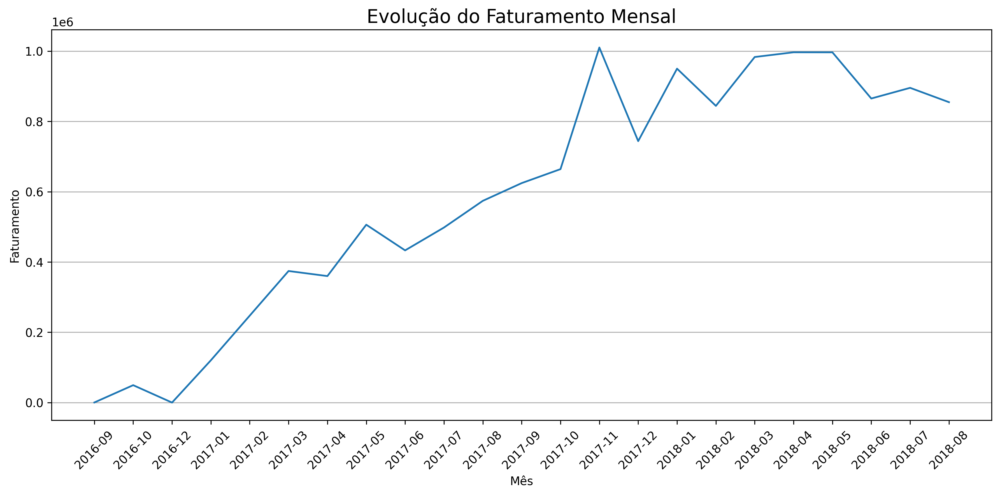
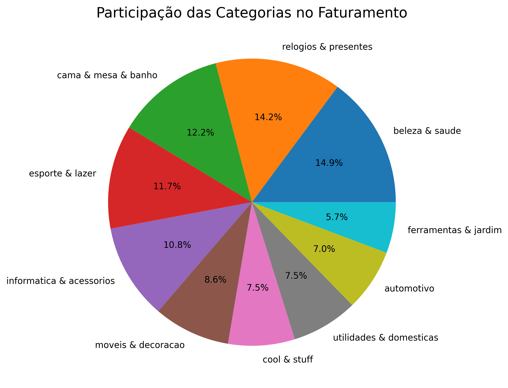
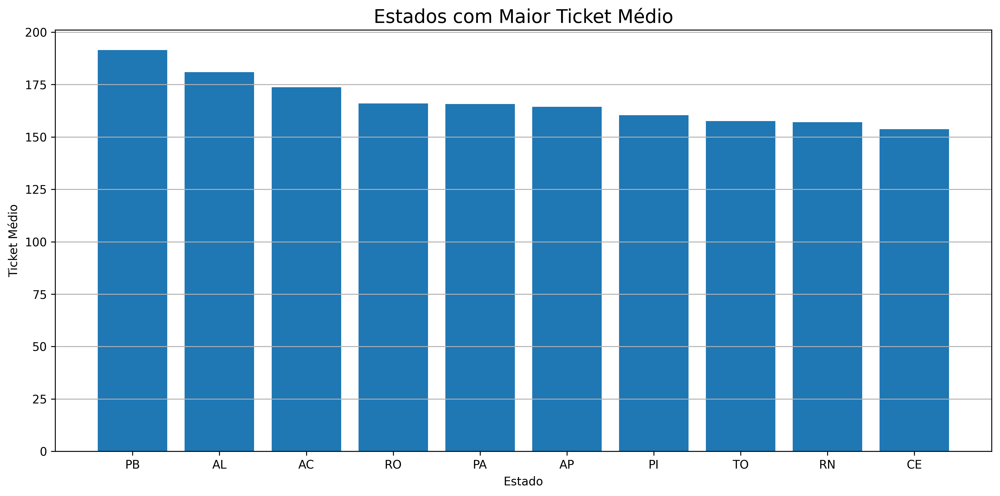
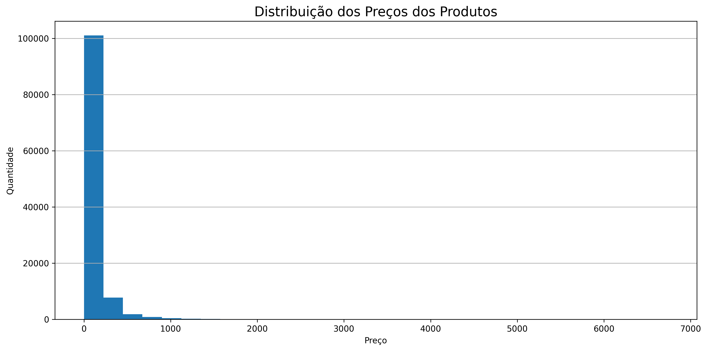

# 📊 Projeto de Análise de Dados em E-commerce

## 📌 Sobre o Projeto

Este projeto tem como objetivo realizar uma análise exploratória de dados de um e-commerce utilizando SQL e Python. A análise foi desenvolvida com foco na identificação de padrões de vendas, comportamento dos clientes, faturamento e tendências ao longo do tempo.

Durante o projeto, foram aplicadas técnicas de manipulação, consulta e visualização de dados para gerar insights relevantes para o negócio.

---

# 🚀 Tecnologias Utilizadas

- Python
- SQL
- SQLite
- Pandas
- Matplotlib
- Jupyter Notebook

---

# 🎯 Objetivos da Análise

- Analisar o faturamento da plataforma
- Identificar os estados com maior volume de vendas
- Calcular ticket médio
- Identificar categorias mais relevantes
- Analisar a evolução do faturamento ao longo do tempo
- Explorar padrões de comportamento dos consumidores

---

# 📈 Principais Análises Realizadas

## Faturamento Total
Análise do volume financeiro movimentado pela plataforma.

## Estados com Mais Vendas
Identificação das regiões com maior quantidade de pedidos.

## Ticket Médio por Estado
Análise do valor médio gasto por compra em diferentes estados.

## Categorias com Maior Faturamento
Identificação das categorias mais relevantes para a receita do e-commerce.

## Evolução do Faturamento Mensal
Análise temporal do crescimento e comportamento das vendas ao longo do tempo.

## Distribuição dos Preços dos Produtos
Análise da concentração de produtos em diferentes faixas de preço.

---

# 📊 Visualizações do Projeto

## Evolução do Faturamento Mensal



---

## Participação das Categorias no Faturamento 



---

## Ticket Médio por Estado



---

## Distribuição dos Preços dos Produtos



---

## 💡 Insights Obtidos

### 🛒 Volume e Faturamento
- O dataset contém **99.441 pedidos** e **112.650 itens** vendidos no período de set/2016 a ago/2018
- O faturamento total da plataforma foi de **R$ 13.591.643,70**
- O ticket médio geral por item é de **R$ 120,65**

### 📦 Categorias
- **cama_mesa_banho** é a categoria com maior volume de vendas (11.115 itens), mas não é a que mais fatura
- **beleza_saude** lidera em faturamento (R$ 1.258.681), com ticket médio mais alto que a líder em volume
- **relogios_presentes** aparece em 2º lugar em faturamento (R$ 1.205.005) mesmo sendo apenas a 7ª em volume — indicando produtos de maior valor unitário

### 🗺️ Distribuição Regional
- **SP concentra 47.449 pedidos** (cerca de 48% do total), seguido por RJ (14.579) e MG (13.129)
- Os estados com maior ticket médio são justamente os menos populosos no volume: **PB (R$ 191,48), AL (R$ 180,89) e AC (R$ 173,73)** — consumidores do Norte e Nordeste compram menos, mas gastam mais por compra

### 📈 Evolução Temporal
- O faturamento cresceu de forma consistente ao longo de 2017, saindo de R$ 120k em jan/2017 para mais de R$ 1 milhão em nov/2017
- **Novembro de 2017 foi o mês de maior faturamento (R$ 1.010.271)**, provavelmente impulsionado pela Black Friday
- Após o pico de novembro, o faturamento se estabilizou acima de R$ 800k mensais em 2018
---

# 🗂️ Estrutura do Projeto

```plaintext
ecommerce-analysis/
│
├── data/
│   ├── olist_customers_dataset.csv
│   ├── olist_order_items_dataset.csv
│   ├── olist_orders_dataset.csv
│   ├── olist_products_dataset.csv
│   └── ecommerce.db
│
├── images/
│
├── notebooks/
│   └── analysis.ipynb
│
├── .gitattributes
│
└── README.md
```

---

# 📂 Fonte dos Dados

Os dados utilizados neste projeto foram obtidos no Kaggle, através do dataset brasileiro de e-commerce Olist.

Dataset:
https://www.kaggle.com/datasets/olistbr/brazilian-ecommerce

O conjunto de dados contém informações sobre pedidos, clientes, produtos, pagamentos e avaliações de um e-commerce brasileiro.

---

# ⚙️ Como Executar o Projeto

## 1. Clonar o repositório

```bash
git clone URL_DO_REPOSITORIO
```

---

## 2. Instalar as dependências

```bash
pip install -r requirements.txt
```

---

## 3. Abrir o Jupyter Notebook

```bash
jupyter notebook
```

---

## 4. Executar o arquivo

Abra:

```plaintext
analysis.ipynb
```

---

# ✅ Conclusão

O projeto permitiu aplicar técnicas de análise de dados utilizando SQL e Python em um cenário real de e-commerce. As análises desenvolvidas possibilitaram identificar padrões importantes de vendas, faturamento e comportamento dos clientes, além de contribuir para o desenvolvimento de habilidades práticas em análise de dados.
